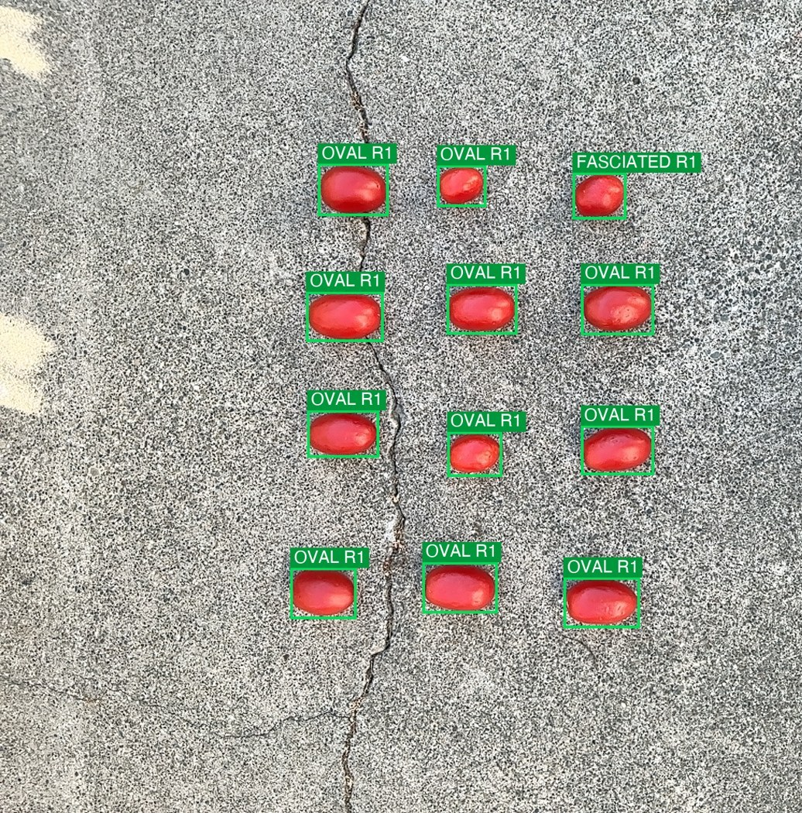

# FruitForm

[](https://github.com/tayloranthonyanderson/FruitForm/actions/workflows/ci.yml)

**An offline iPhone app that turns a pile of tomatoes into per-fruit shape & size data** —
shape class, a 1–9 shape-quality rating, size (cm), volume, weight, eccentricity,
flatness, and color — using the LiDAR depth camera and three on-device neural nets (a
detector plus two classifiers). No
cloud, no scale card. A personal side project exploring on-device computer vision and
LiDAR depth measurement.

> *Personal project, built on my own time and equipment using publicly available or
> self-collected data. Not affiliated with, funded by, or derived from any employer's
> work, data, or systems.*



*A single example tray, captured on-device: each fruit is segmented, then run through the
shape and rating classifiers while LiDAR measures absolute size — all on-device.*

## The interesting problem

Tomatoes rest **pole-up**, so a top-down photo only sees the fruit's **equatorial
cross-section**. The dimension that actually separates a flat, round, and elongated
fruit — the polar height — points straight at the lens and is **invisible in 2D**. A
plain 2D classifier (and even a general cloud vision model) calls a flat beefsteak and a
round globe both "round." This viewpoint constraint drives the whole design:

- A classifier trained on your *own* top-down photos learns the human-visible
  cues (blossom-end scar, lobing) that correlate with shape from above.
- **LiDAR recovers the missing axis** — depth gives true size and a `flatness` metric the
  silhouette can't see.

## How it works — a detector + two classifiers (three on-device models)

```
Photo (12 MP) ─► Segmenter (YOLOv8-seg, Core ML) ──► box + mask per fruit
                     └─ per fruit ─► crop ─► Shape classifier (YOLOv8-cls)  → round/oval/flat/fasciated
                                        └─► Rating classifier (YOLOv8-cls)  → 1–9 desirability
                     └─ box + mask + LiDAR depth + intrinsics ─► size · volume · weight · flatness · color
```

Three small models — one detector and two classifiers (shape + rating) — run
**sequentially on-device** (Core ML / Vision / the Neural Engine).
Keeping detection and classification separate means shape can improve from more *shape*
labels without ever retraining detection. The detector even doubles as the tool that
chops labeled group photos into per-fruit crops to *build* the classifier's training set.

## Engineering highlights

A few problems that were more interesting than the feature list:

- **A train/serve skew that looked like a model failure.** On-device, every fruit came
  back "flat/fasciated, rating 9" at high confidence — yet every offline test on the same
  photos was correct. The crop fed to the classifier padded by a fraction of the **image**
  (~115 px) instead of the **box** (~7 px), burying each fruit in background: the model was
  fine, the *input framing* didn't match training. Fixed by collapsing crop math to one
  helper ([`CropGeometry`](FruitForm/Vision/CropGeometry.swift)) and pinning it with a
  [regression test](Tests/CropGeometryTests.swift) that asserts the pad is box-relative —
  the exact value at the shared train/serve boundary, so the skew can't silently return.
- **Leak-free evaluation.** Multiple fruit share one photo, so a naive train/val split
  leaks near-duplicates across the boundary and inflates accuracy. The split is
  **grouped by source photo** — no photo's fruit straddle train and val — so the reported
  numbers reflect generalization, not memorized backgrounds (see [LEARNINGS.md](LEARNINGS.md)).
- **A silent `Decodable` default-value trap.** Adding a new `mode` field made the app fail
  to load *every* existing capture: Swift's synthesized `Decodable` throws on a missing key
  **even when the property has a default**. The default never applies to absent JSON keys.
  Fix: new manifest fields are `Optional`.
- **Capture resolution.** ARKit's live frame is only 2.8 MP; switching to
  `captureHighResolutionFrame` (12 MP) sharpened both the archive and the classifier
  crops while keeping LiDAR depth intact.

[LEARNINGS.md](LEARNINGS.md) documents the *why* behind the non-obvious decisions and the
gotchas (coordinate frames, Core ML name collisions, MPS quirks). Read it before changing
the vision code.

## Tech stack

- **App:** Swift, SwiftUI, ARKit + RealityKit/SceneKit, Core ML, Vision, Accelerate.
- **ML:** Python, Ultralytics YOLOv8 (seg + cls), PyTorch, Core ML Tools; trained on
  device-collected data with leak-free grouped train/val splits.
- **Tooling:** XcodeGen (project generated from `project.yml`), XCTest, GitHub Actions CI.

## What it captures (CSV, one row per fruit)

`major_axis_cm`, `minor_axis_cm`, `shape_index`, `eccentricity`, `flatness`, `solidity`,
`volume_cm3`, `weight_g_est`, `shape_category`, `shape_rating`, `ripeness`, `color_hex`,
`occluded`, `source`.

## Build & run

Requires **Xcode 26+**, **[XcodeGen]**, and a **LiDAR iPhone** (12 Pro or newer Pro, iOS 17+).

```bash
brew install xcodegen
xcodegen generate            # generates FruitForm.xcodeproj from project.yml
open FruitForm.xcodeproj # set your own signing team, pick your iPhone, ⌘R
```

Full walkthrough: **[INSTALL.md](INSTALL.md)**. Run the tests with:

```bash
xcodebuild test -scheme FruitForm -destination 'platform=iOS Simulator,name=iPhone 16'
```

## Repo layout

```
FruitForm/   SwiftUI app — Capture/ Vision/ UI/ Data/ Models/ Cloud/  + committed .mlpackage models
Tests/           XCTest unit tests (crop geometry, training modes, letterbox math)
ml/              Python training pipeline (extract crops → train → export Core ML)
docs/            demo media
project.yml      XcodeGen spec (the .xcodeproj is generated, not committed)
```

## ML pipeline (`ml/`)

```bash
python3 -m venv ml/.venv && source ml/.venv/bin/activate && pip install -r ml/requirements.txt
```

`extract_crops.py` (group photos → per-fruit crops, leak-free split) → `train_cls.py` /
`train_rating.py` (YOLOv8-cls → Core ML) → copy `best.mlpackage` into the app → rebuild.

## Notes & limits

- **Shape v2 = 4 classes**, **rating = odd anchors 1/3/5/7/9** so far — proof-of-concept
  models from a small single-rater dataset; accuracy improves with more diverse capture.
- The fruit **detector is trained on [LaboroTomato] (CC BY-NC-SA 4.0 — non-commercial)**;
  any redistribution of those weights inherits that license. Research/portfolio use only.
  See [NOTICE.md](NOTICE.md) for the full source-code (MIT) vs. bundled-model licensing split.
- **Classifier training data:** the shape/rating models were trained on my own photos of
  grocery-store tomatoes I bought myself. No proprietary or employer germplasm, data, or
  imagery is used anywhere in this project.
- Built with substantial **AI pair-programming (Claude Code)** as a tool; the
  architecture decisions, domain framing, and debugging were human-directed.

[XcodeGen]: https://github.com/yonaskolb/XcodeGen
[LaboroTomato]: https://github.com/laboroai/LaboroTomato
